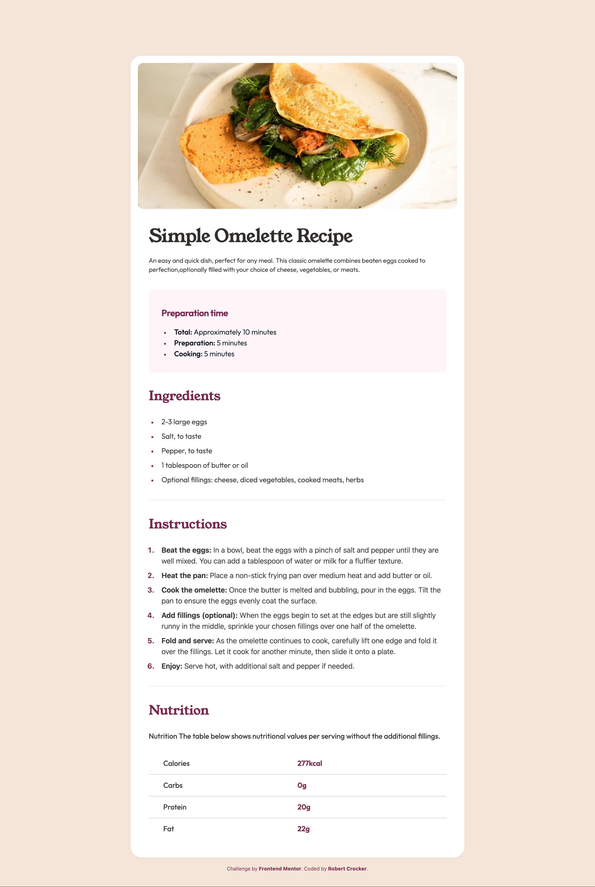

# Frontend Mentor - Recipe page solution

This is a solution to the [Recipe page challenge on Frontend Mentor](https://www.frontendmentor.io/challenges/recipe-page-KiTsR8QQKm). Frontend Mentor challenges help you improve your coding skills by building realistic projects.

## Table of contents

- [Overview](#overview)
  - [Screenshot](#screenshot)
  - [Links](#links)
- [My process](#my-process)
  - [Built with](#built-with)
  - [What I learned](#what-i-learned)
  - [Continued development](#continued-development)
- [Author](#author)

## Overview

### Screenshot

### Links

- Live Site URL: [Add live site URL here](recipe-page-seven-beta.vercel.app)

## My process

### Built with

- Figma
- Semantic HTML5 markup
- Tailwind
- NextJS
- Responsive Design
- [React](https://reactjs.org/) - JS library
- [Next.js](https://nextjs.org/) - React framework

### What I learned

This project introcuded the idea of customizing the bullets of ordered and unordered lists.

### Continued development

My process is coming along well. I will start to templatize more of the initial setup. Too much time is currently spent getting the project started. I would also like to move into working more with Figma and connecting that tool to my development process.

## Author

- Website - [Robert Crocker](https://www.robcrock.com)
- Frontend Mentor - [@robcrock](https://www.frontendmentor.io/profile/robcrock)
- Twitter - [@robcrock](https://twitter.com/robcrock)
- LinkedIn - [@robercrocker](https://www.linkedin.com/in/robertcrocker/)
